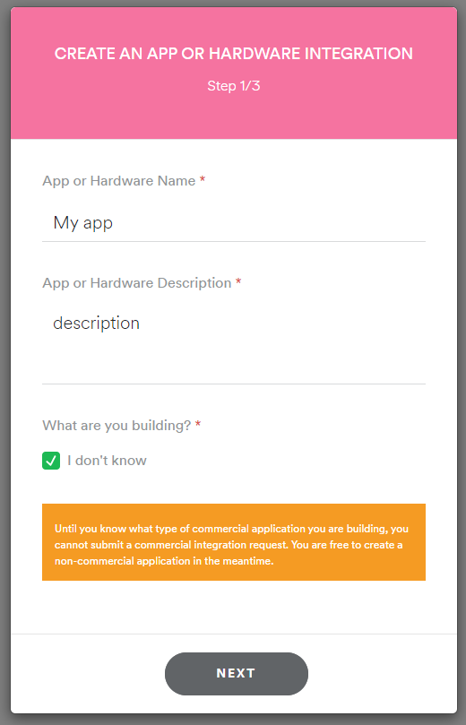
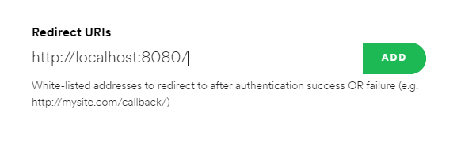
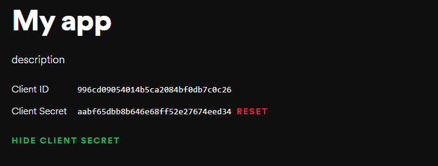

# Album Art Wallpaper

This is a system tray app for windows that will change your desktop wallpaper based on the track you are listening to on Spotify.


As the artwork provided is only 640px if you are using a higher resolution than 1080p the artwork will be smaller. However there is an option to resize the image in the settings.
An internet connection is required.

## Getting Started
There is a short initial setup:

1. Get your api keys and add them to config.ini (below)
2. Set default wallpaper in the context menu.

### Getting your API Keys
Head over to the [Spotify developer dashboard](https://www.google.com) and create a non-commercial app, call it whatever you like, select any use case and give it a description.


Once you are on the app page go to EDIT SETTINGS > Redirect URIs, enter ``` http://localhost:5000/callback/ ``` exactly and make sure to save it.


Copy and paste the Client ID and Client Secret into the config.ini file.


## Running the code
Install the dependencies ```pip install -r requirements.txt``` and run album-art-wallpaper.py ```python album-art-wallpaper.py```

### Settings
There are two settings in the config.ini file:

- ```request_interval``` controls how often a request is sent to the Spotify Web API.
- ```resize_art``` when true will resize the 640px album art to fit on the smallest axis.
<<<<<<< HEAD

## Example

=======
>>>>>>> e0fe7ff8124aae2a6124d0ac2565f4e411c379a6
